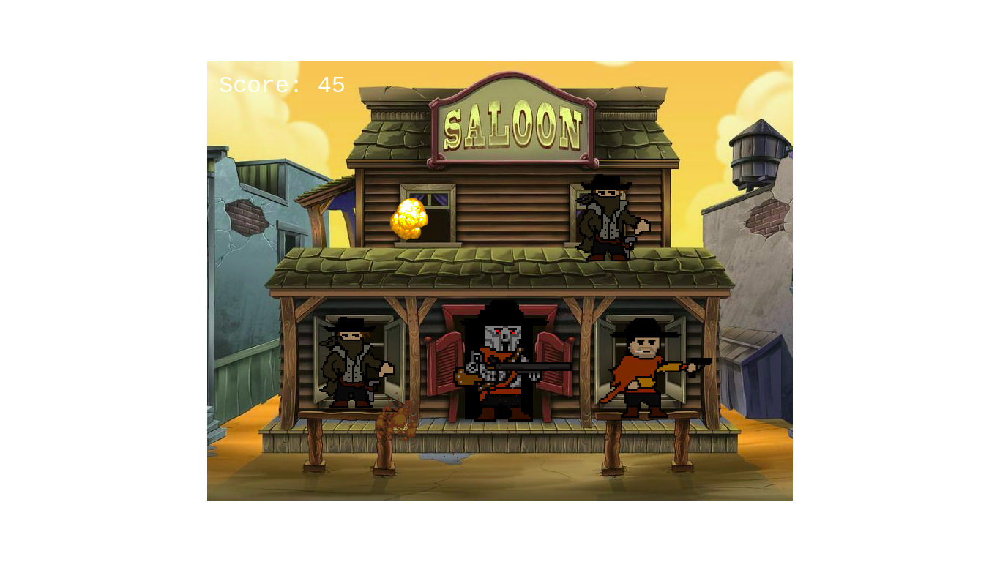
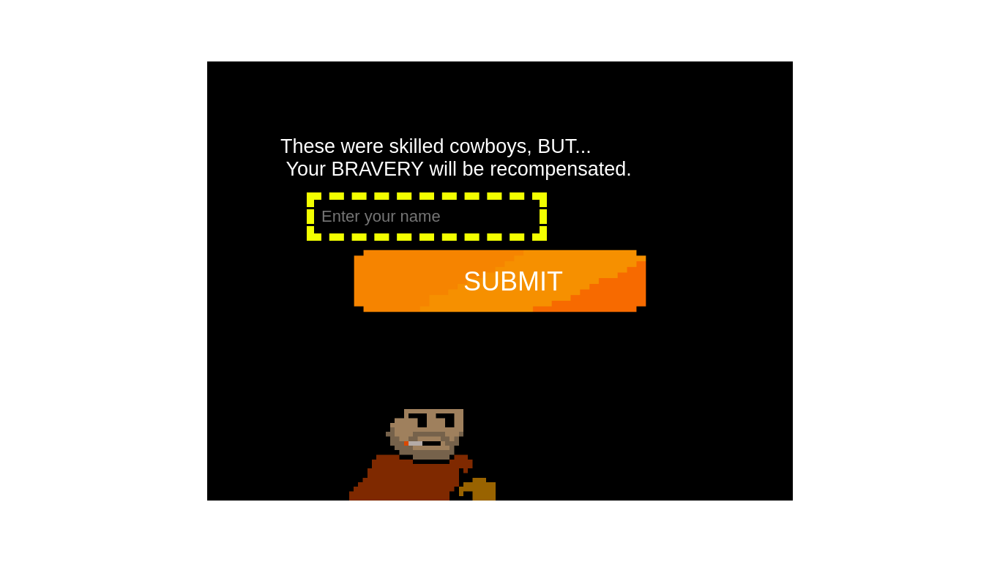
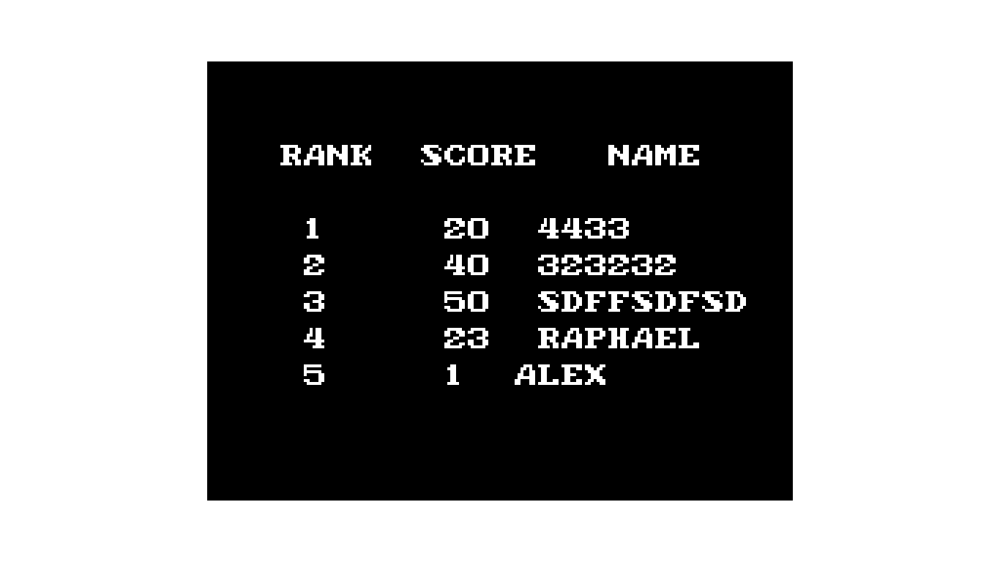

[![Contributors][contributors-shield]][contributors-url]
[![Forks][forks-shield]][forks-url]
[![Stargazers][stars-shield]][stars-url]
[![Issues][issues-shield]][issues-url]
[![MIT License][license-shield]][license-url]

# Cowboy Shooter Game (js project)
 

  

  <h3 align="center">
    The last project from the Microverse Javascript Curriculum
  </h3>

  <h3 align="center">
	 Live Version link - https://alexawesomecode.github.io/cowboy-game
  </h3>

  

 A capstone shooter game from Microverse</a>
     

  

## Project 'Cowboy Shooter Game'

A game project app built with Javascipt. This is part of the Javascript Curriculum of Microverse School. The goal behind this project is to build a shooter game with Phaser 3. The requirements are the ability to gain score, kills enemies, lo lose and get your score level saved to a leaderboard. Oh! And also to have fun!

    

## Design

This game was designed using Phaser 3. It contains three files for Scenes (Main Game Scene, Game Over Scene and Leaderboard Scene) and one file for the game logic called 'GameLogic.js'. The main purpose of this file is to create characters, handle the the characters logic, save the score and manage the Game Over logic.

The rules of the game are: You have to free a playful king that was captured by some bad cowboys. You need to shoot at them and be very carefull not to kill king (he likes to jump all over the screen, he loves freedom and fun). If you touch the king you lose. 

Once you kill the game, you get a chance to store your name:

    

Then you can click the submit button, or better, shoot with your mouse!

You get a list of players and their scores, a Leaderboard.

    

# Validations

-ESLINT

# Get Started

Download or clone this [repo here](https://github.com/alexawesomecode/cowboy-game). The run 'npm install' to install all the requirements and then open your browser, hit http://localhost:3000/build/index.html  and kill some bad guys!

# Built With

This project was built with these techologies:

* Phaser 3
* Javascript
* ES6
* Webpack & Babel
* HTML
* CSS3

# Authors

**Alejandro Andres**

- Github: [@alexawesomecode](https://github.com/alexawesomecode)
- Twitter: [@alexcode0](https://twitter.com/alexcode0)
- Linkedin: [Alejandro Andres](https://www.linkedin.com/in/alejandro-andres-126592191/)

# License

This project is licensed under the MIT License - see the [LICENSE.md](LICENSE.md) file for details

<!-- ACKNOWLEDGEMENTS -->
## Acknowledgements
* [Microverse](https://www.microverse.org/)
* [The Odin Project](https://www.theodinproject.com/)

<!-- MARKDOWN LINKS & IMAGES -->
<!-- https://www.markdownguide.org/basic-syntax/#reference-style-links -->
[contributors-shield]: https://img.shields.io/github/contributors/alexawesomecode/cowboy-game.svg?style=flat-square
[contributors-url]: https://github.com/alexawesomecode/cowboy-game/graphs/contributors
[forks-shield]: https://img.shields.io/github/forks/alexawesomecode/cowboy-game
[forks-url]: https://github.com/alexawesomecode/cowboy-game/network/members
[stars-shield]: https://img.shields.io/github/stars/alexawesomecode/cowboy-game
[stars-url]: https://github.com/alexawesomecode/cowboy-game/stargazers
[issues-shield]: https://img.shields.io/github/issues/alexawesomecode/cowboy-game
[issues-url]: https://github.com/alexawesomecode/cowboy-game/issues
[license-shield]: https://img.shields.io/github/license/alexawesomecode/cowboy-game
[license-url]: https://github.com/alexawesomecode/cowboy-game/blob/master/LICENSE.txt
